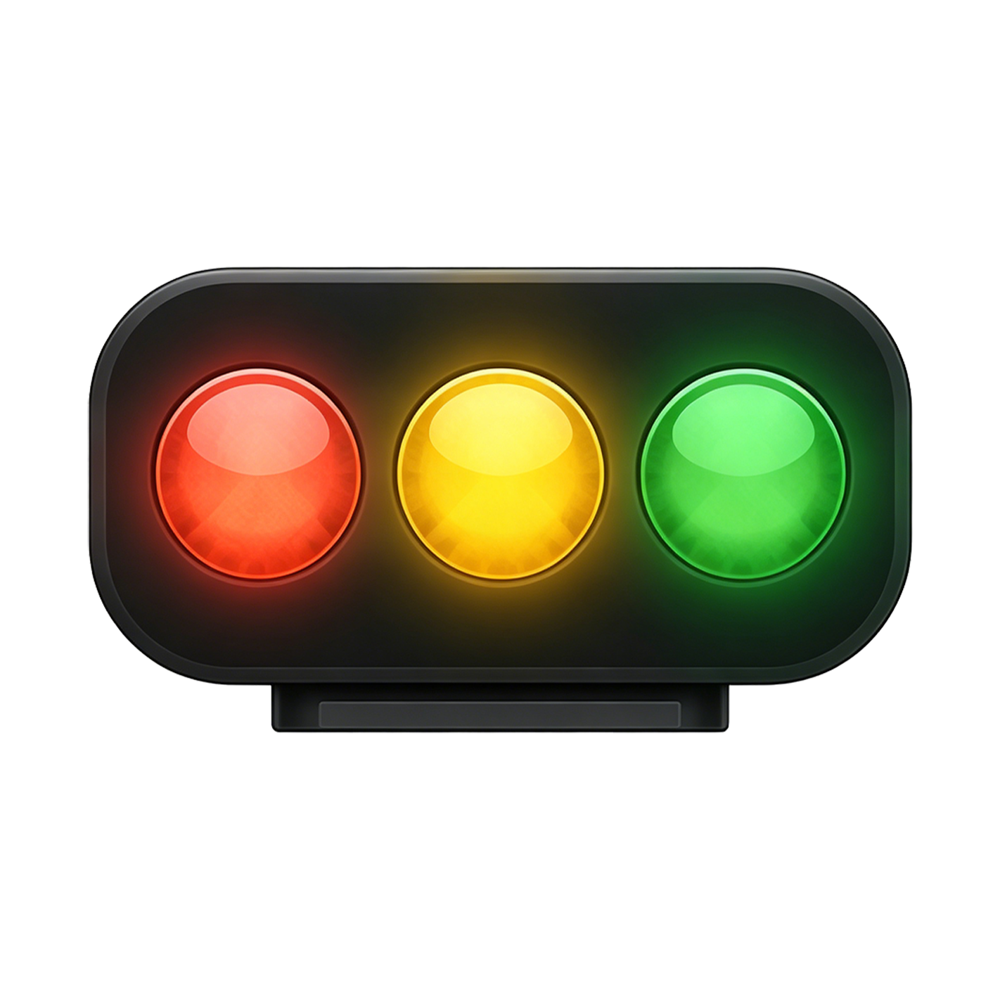
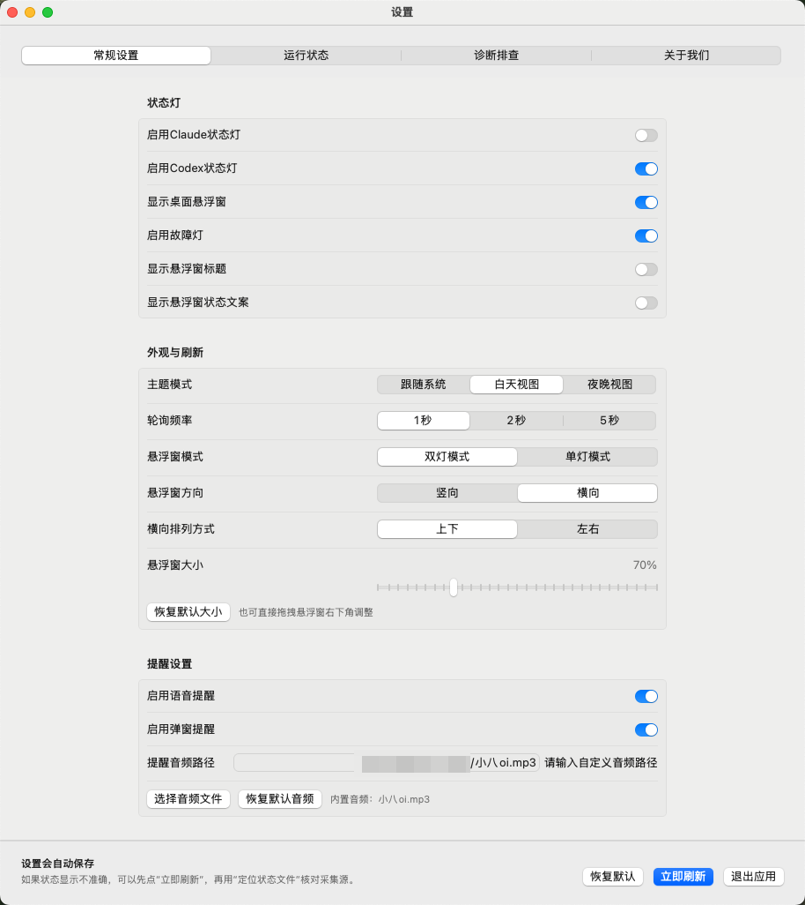
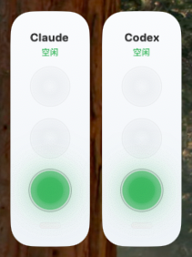
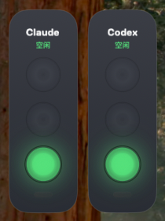
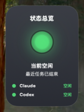

<div align="center">
  
  <h1 align="center">Agent Status Light</h1>

  <p align="center">
    
    
    
    
    <a href="LICENSE"></a>
  </p>
  <br>
  <h3><a href="README.md">简体中文</a> | English</h3>
  <br>
  A macOS menu bar status light for <b>Claude</b> and <b>Codex</b> workflows.<br>
  It reads local status sources and helps you quickly see whether an agent is <b>running</b>, <b>waiting for user input</b>, <b>idle</b>, or <b>failed</b>.
</div>

# 1. Overview

Agent Status Light is a lightweight desktop status monitor for local AI coding workflows.

When you are switching between terminals, editors, browsers, and multiple projects, it turns Claude and Codex activity into menu bar lights and a floating desktop panel, so you do not need to keep jumping back to the terminal just to check progress.

It is mainly designed to help with these situations:

- See whether Claude or Codex is still working without switching back to the terminal
- Notice immediately when the agent is waiting for confirmation, authorization, or input
- Detect recent task failures, API issues, or token-related problems through red or fault lights
- Open the data directory or locate the exact status file when the displayed state looks wrong

# 2. Screenshots

<table>
  <tr>
    <td align="center"></td>
  </tr>
  <tr>
    <td align="center">Settings Window</td>
  </tr>
</table>

<table>
  <tr>
    <td align="center"></td>
    <td align="center"></td>
  </tr>
  <tr>
    <td align="center">Light Floating Panel</td>
    <td align="center">Dark Floating Panel</td>
  </tr>
</table>

<table>
  <tr>
    <td align="center"></td>
  </tr>
  <tr>
    <td align="center">Single Light Mode</td>
  </tr>
</table>

# 3. Features

- [x] Aggregated menu bar status light for overall state at a glance
- [x] Dedicated settings window for status lights, theme, refresh frequency, and alerts
- [x] Dual-channel status collection for both Claude and Codex
- [x] Floating desktop panel with single-light mode, dual-light mode, horizontal layout, and vertical layout
- [x] Configurable floating window title, state text, and scale
- [x] Voice alerts and popup alerts
- [x] Independent fault light for API errors, authentication failures, insufficient quota, and related external issues
- [x] Diagnostic tools for opening the data directory and locating the current status file
- [x] Directory watching combined with polling for both responsiveness and stability

# 4. Light Semantics

Current light meanings are:

- Solid green: idle, or the most recent task finished successfully
- Slow blinking yellow: Claude or Codex is running, thinking, streaming output, calling tools, or modifying files
- Solid yellow: waiting for user input, confirmation, authorization, or manual handling
- Solid red: a recent task clearly failed, or an execution error was detected
- Fast blinking fault light: API request failure, invalid token, insufficient quota, model overload, or similar external issue
- Gray or off: disabled, unavailable, or no reliable status source was found

The aggregated menu bar light uses this priority:

- Red has higher priority than yellow
- Yellow has higher priority than green
- Green has higher priority than gray
- The fault light is independent and does not share the same meaning as regular status lights

# 5. Requirements

- Operating system: macOS 13.0 or later
- Hardware: Apple Silicon and Intel Mac
- Development environment: a recent version of Xcode is recommended

The project currently depends on some newer system capabilities, including:

- SwiftUI `LabeledContent`
- SwiftUI `GroupedFormStyle`
- Swift concurrency `Task.sleep(for:)`

# 6. Quick Start

## 6.1 Clone the repository

```bash
git clone <your-repository-url>
cd agent-status-light-git
```

## 6.2 Open with Xcode

```bash
open agent-status-light.xcodeproj
```

## 6.3 Run the app

Select the `agent-status-light` scheme in Xcode and run it directly.

After launch, you will get:

- A menu bar status light
- A dedicated settings window
- A floating desktop panel
- A runtime status panel
- Diagnostic entry points

If popup alerts are enabled, macOS may ask for notification permission.

# 7. Status Sources

The app infers runtime state from local files and session records. By default, it reads the following locations:

| Agent | Status Source |
| --- | --- |
| Claude | `~/.claude/todos` |
| Claude | `~/.claude/projects` |
| Codex | `~/.codex/state_5.sqlite` |
| Codex | `~/.codex/session_index.jsonl` |
| Codex | `~/.codex/sessions` |

Notes:

- Claude status is mainly inferred from todo files and project session logs
- Codex status is mainly inferred from the SQLite state database, session index, and session JSONL files
- The app uses both directory watching and polling, where watching handles real-time refresh and polling serves as a fallback

# 8. Usage

## 8.1 Menu Bar

- The menu bar shows the aggregated overall light state
- Claude is fixed on the left and Codex is fixed on the right
- If an agent is disabled, its light becomes gray or is excluded from aggregation

## 8.2 Settings Window

The settings window currently includes these sections:

- General
- Runtime
- Diagnostics
- About

You can use it to:

- Enable or disable the Claude light
- Enable or disable the Codex light
- Enable or disable the floating desktop panel
- Enable or disable the fault light
- Switch theme mode
- Adjust polling frequency
- Switch floating window mode and lamp layout direction
- Adjust horizontal arrangement
- Show or hide title and state text
- Enable or disable voice alerts and popup alerts
- Change the custom alert audio path

## 8.3 Diagnostics

If the displayed state looks incorrect, use this order for troubleshooting:

1. Click `Refresh Now`
2. Open the `Diagnostics` section
3. Click `Open Data Directory` to verify the watched paths
4. Click `Reveal Status File` to inspect the exact source used for the current state

# 9. Project Structure

```text
agent-status-light-git
├─agent-status-light
│  ├─App
│  ├─Models
│  ├─Services
│  ├─Utilities
│  ├─Views
│  ├─Assets.xcassets
│  └─Audio
├─agent-status-light.xcodeproj
└─README-en.md
```

Directory responsibilities:

- `App`: app entry and lifecycle
- `Models`: state models, settings models, and core data structures
- `Services`: status collection, aggregation, alerts, floating window, and menu bar control
- `Utilities`: file system, SQLite, and formatting helpers
- `Views`: settings window, floating panel, status panel, and shared theme views
- `Assets.xcassets`: icons, colors, and bundled assets
- `Audio`: default alert audio

# 10. Use Cases

- You use Claude Code and Codex side by side on your local machine
- You often leave agent tasks running in the background and want an instant visual signal
- You want fast desktop feedback when an agent is waiting for your confirmation or input
- You need to inspect status source files when the light behavior does not match your expectation

# 11. Roadmap

This project is intentionally focused on status collection, status aggregation, and desktop presentation. It does not execute conversations or tasks by itself.

Possible future directions include:

- Support for more local agent types
- Better accuracy for failure, waiting, and fault detection
- More menu bar icon styles and floating panel visual options
- Richer notification, alert, and diagnostic capabilities

# 12. Contact

If you run into issues or want support for more agent types, you can reach out through:

- WeChat: `cxyax_`
- Email: `gaoxin1153@163.com`

# 13. License

This project is released under the [MIT License](./LICENSE).
